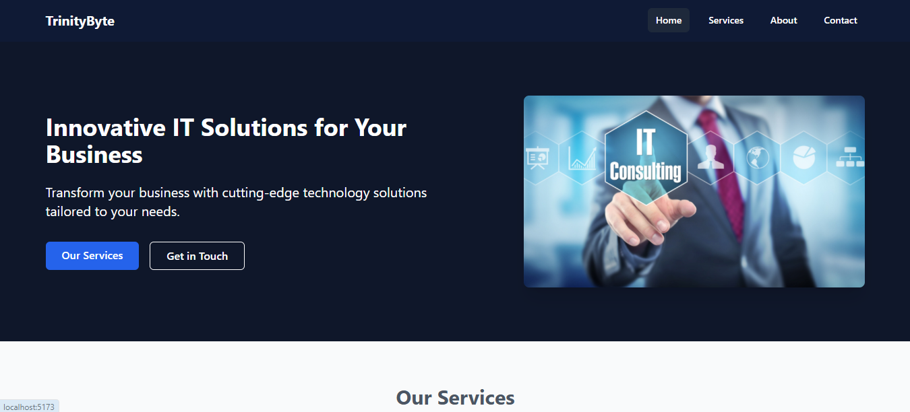

# 🌐 TrinityByte IT - Company Website

<p align="center">
  
</p>
 
---

## 🚀 Overview
**TrinityByte IT** is the official website of our IT company, built using **React JS**.  
It is fully responsive, clean, and modern — designed to showcase our services and connect with clients.  

✨ **Features:**
- ⚡ Fast and responsive  
- 🎨 Modern UI with React + CSS Framework  
- 📑 Multi-page navigation with React Router  
- 📬 Contact form for inquiries  

---

## 🛠️ Tech Stack
- ⚛️ **React JS** – Frontend Library  
- 🌐 **React Router DOM** – Client-side Routing  
- 🎨 **Tailwind CSS** – Styling & Layout  
- 📜 **Javascript** – Component Logic  
- 🖼️ **HTML5 & CSS3** – Structure & Design  

---

## 💻 Installation & Setup

Follow these steps to get the project running locally:

```bash
# 🛠️ 1. Clone this repository
git clone https://github.com/masum-mir/trinitybyte.git

# 📂 2. Navigate to the project directory
cd trinitybyte

# 📦 3. Install dependencies
npm install

# 🚀 4. Start the development server
npm run dev
 
---

✅ Notes:   
- If your React project uses **Vite**, the default `npm run dev` port is `5173`.  
- For **Create React App**, use `npm start` instead of `npm run dev`.  
 
